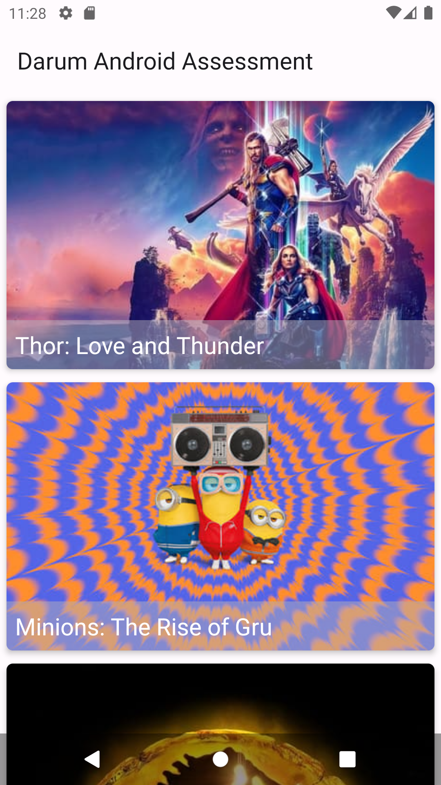
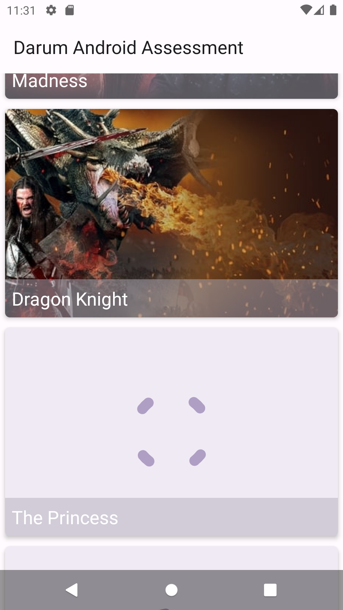
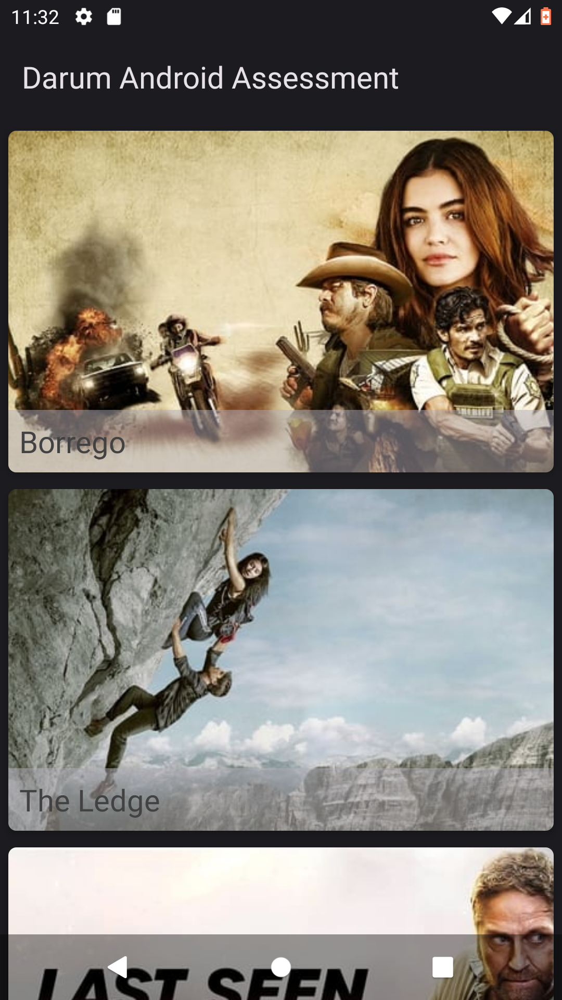

 
 

# Darum Android Assessment
A simple android Movie app built using MVVM architecture and Jetpack libraries that allows users to view popular movies. This project was built with 100% Kotlin.

## SDK Requirements
- Minimum SDK Requirement - android API 21 (Lollipop)
- Target SDK - android API 32 (Android 13)

## Installation
- To run this code, clone this repository using this command

`git clone https://github.com/segunfrancis/Darum-Android-Assessment.git`
- Import into android studio
- Get your API key from [here](https://developers.themoviedb.org/3/getting-started/introduction)
- Navigate to the `local.properties` file and add a field for your api key as shown in the image below

  
- Build the project and run on an android device or emulator

## Built With

* [Android Jetpack](https://developer.android.com/jetpack) - Suite of libraries, tools, and guidance to help developers write high-quality apps easier.
    * [Android KTX](https://developer.android.com/kotlin/ktx)
    * [ViewBinding](https://developer.android.com/topic/libraries/view-binding)
    * [ViewModel](https://developer.android.com/topic/libraries/architecture/viewmodel)
    * [Paging 3](https://developer.android.com/topic/libraries/architecture/paging/v3-overview)
    * [Android Material Design Components](https://material.io/develop/android/docs/getting-started)
* [Kotlin Coroutines](https://developer.android.com/kotlin/coroutines) - Concurrency design pattern used on Android to simplify code that executes asynchronously.
* [Flow](https://kotlinlang.org/docs/reference/coroutines/flow.html) - Kotlin API that can return multiple asynchronously computed values.
* [Retrofit](https://square.github.io/retrofit/) - A type-safe HTTP client for Android and Java
* [OkHttp](https://square.github.io/okhttp/) - An efficient HTTP client
* [Hilt](https://developer.android.com/training/dependency-injection/hilt-android) - A dependency injection library for Android that reduces the boilerplate of doing manual dependency injection in your project.
* [Glide v4](https://bumptech.github.io/glide/) - A fast and efficient image loading library for Android focused on smooth scrolling
* [Timber](https://github.com/JakeWharton/timber) - A logger with a small, extensible API which provides utility on top of Android's normal Log class.
* [Lottie for Android](https://github.com/airbnb/lottie-android) - A library that helps you render After Effects animations natively on Android

## Screenshots
<ul>
  
  
  
</ul>

## Author

* [Segun Francis](https://www.linkedin.com/in/segun-francis-302361a1)

## License

      Copyright 2022 Segun Francis

      Licensed under the Apache License, Version 2.0 (the "License");
      you may not use this file except in compliance with the License.
      You may obtain a copy of the License at

        http://www.apache.org/licenses/LICENSE-2.0

      Unless required by applicable law or agreed to in writing, software
      distributed under the License is distributed on an "AS IS" BASIS,
      WITHOUT WARRANTIES OR CONDITIONS OF ANY KIND, either express or implied.
      See the License for the specific language governing permissions and
      limitations under the License.
